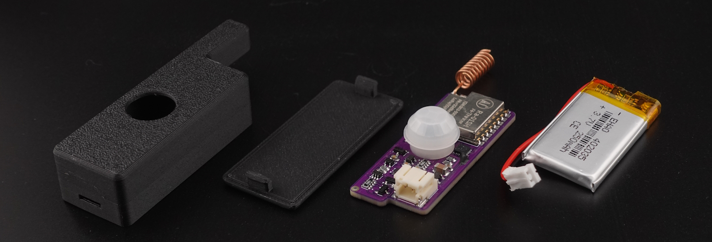
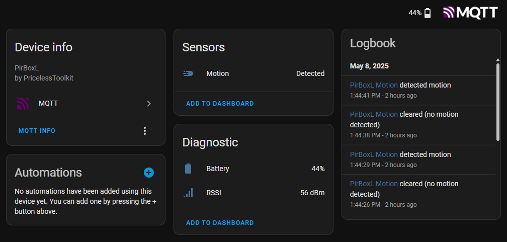
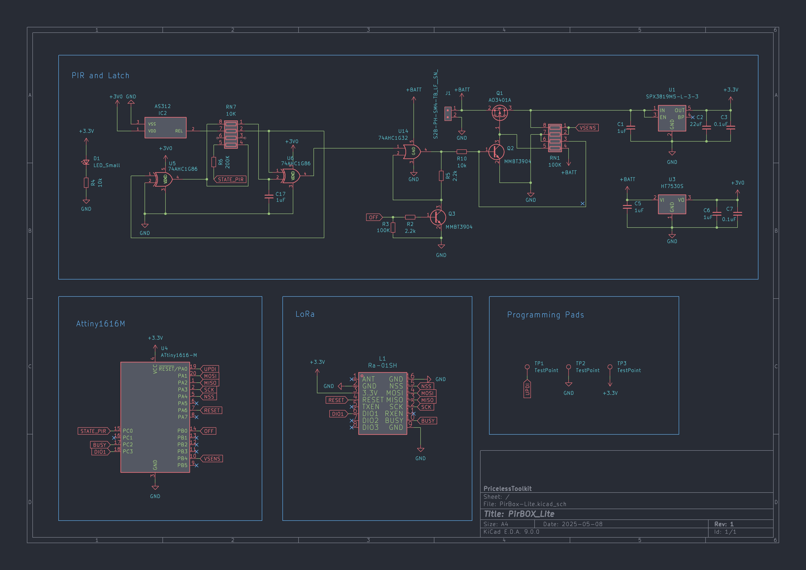

🤗 Please consider subscribing to my [YouTube channel](https://www.youtube.com/@PricelessToolkit/videos)
Your subscription goes a long way in backing my work. If you feel more generous, you can buy me a coffee


[](https://ko-fi.com/U6U2QLAF8)

## PirBOX-LITE

**PirBOX-LITE** is an Open-Source, compact, low-power LoRa-based PIR motion sensor designed for long-range applications such as mailboxes, basements, underground "garages/parkings", and remote sheds. It is the improved, more affordable successor to the **[MailBox-Guard](https://github.com/PricelessToolkit/MailBoxGuard)** project.



#### 🛒 Can be purchased in my shop http://www.PricelessToolkit.com

### Key Features:
- Seamless integration with **Home Assistant MQTT**  
- **LoRa-based communication** for long-range, low-power use cases  
- Sends **( Detected** / **Cleared )** statuses to a LoRa gateway "**[CapiBridge](https://github.com/PricelessToolkit/CapiBridge) or LilyGo LoRa Board**"  
- **Ultra-low power consumption**: ~15 µAh when idle or in constant detection  
- Powered by a **250 mAh battery** for long-lasting operation
- Perfect for remote monitoring where Wi-Fi or Zigbee range isn't enough

> [!NOTE]
> **Not intended** for indoor use or high traffic areas, Zigbee devices are better suited for that.  

### Required:
- Gateway **[CapiBridge](https://www.pricelesstoolkit.com/en/projects/42-129-capibridge-gateway-kit.html#/41-frequency-868_915_mhz) or LilyGo LoRa Board**
- Programmer [UNIProg](https://www.pricelesstoolkit.com/en/projects/33-uniprog-uartupdi-programmer-33v-0741049314412.html) or any other 3.3v UPDI Programmer
- LiPo Battery [1S 250mAh](https://www.pricelesstoolkit.com/en/products/47-battery-li-po-37v-250mah-ph-20mm-2-pin.html) or less (Connector PH2.0) Important! MAX SIZE "35x20x4mm"
- Pogo PIN Clamp 1x6 PIN "Only for convenience" https://s.click.aliexpress.com/e/_ooPke35

### Choosing a Gateway Hardware
1. [CapiBridge LoRa/ESP-NOW Gateway](https://github.com/PricelessToolkit/CapiBridge): I developed this project, featuring multi-protocol support, including LoRa and ESP-NOW. It will be compatible with my future LoRa and ESP-NOW sensor projects. Purchasing this gateway will support my ongoing open-source developments.
2. [LilyGo LoRa Board](https://github.com/PricelessToolkit/MailBoxGuard/tree/main?tab=readme-ov-file#select-ttgo_lora-board-version): This option is more affordable but only has LoRa and support is limited.

### Configuration / Reflashing:
> [!NOTE]
> By default, it comes already flashed with the default firmware. Code"xy"

1. Install MegaTinyCore in Arduino IDE "http://drazzy.com/package_drazzy.com_index.json"
2. Download the PirBOX-Lite project file; don't just copy and paste the code.
3. Open the PirBox-Lite.ino file in Arduino IDE. "It will include all necessary files and Radio Library."
4. In Config.h, change the sensor name, gateway key, and radio settings based on your gateway config
```c
/////////////////////////// LoRa Gateway Key ///////////////////////////

#define GATEWAY_KEY "xy"          // Keep it Short
#define NODE_NAME "PirBoxL"        // Sensor Name which will be visible in Home Assistant

////////////////////////////// LORA CONFIG ////////////////////////////////////

#define BAND                      868E6     // 433E6 MHz or 868E6 MHz or 915E6 MHz
#define TX_OUTPUT_POWER           20        // dBm tx output power
#define LORA_BANDWIDTH            4         // bandwidth 2: 31.25Khz, 3: 62.5Khz, 4: 125Khz, 5: 250KHZ, 6: 500Khz
#define LORA_SPREADING_FACTOR     8         // spreading factor 6-12 [SF5..SF12]
#define LORA_CODINGRATE           1         // [1: 4/5, 2: 4/6, 3: 4/7, 4: 4/8]
#define LORA_PREAMBLE_LENGTH      6         // Same for Tx and Rx
#define LORA_PAYLOADLENGTH        0         // 0: Variable length packet (explicit header),  1..255 for Fixed length packet (implicit header)
#define LORA_CRC_ON               true
   
```
5. Select board configuration as shown below.


6. Disconnect the Battery if connected. Then connect the UPDI programmer to the back of the PirBOX using the pogo pin clamp, or any method you prefer.


<table>
  <tr>
    <td></td>
    <td>

<!-- Markdown-style table inside HTML cell -->
  
| **PirBOX** | **Programmer** |
|------------|----------------|
| 3.3V       | 3.3V           |
| GND        | GND            |
| UPDI       | UPDI           |

</table>


7. In Arduino IDE, select the COM Port and programmer "SerialUPDI-230400 baud "Required UPDI Programmer"
8. Click "Upload Using Programmer" or "Ctrl + Shift + U", Done!

____________

# Do you want to assemble it yourself?
This project is open-source and includes Source code, 3D Print files, and Gerber files, allowing you to order blank PCBs and assemble the PirBOX-Lite yourself. To help with manual assembly, I've included an Interactive HTML BOM in the PCB folder. This tool shows the placement and polarity of each component, helping to eliminate errors during soldering.

> [!NOTE]
>  Please note that POS (Pick and Place) files and KiCad source files are not included. These are intentionally omitted, as this project is intended for manual assembly. If you prefer a ready-to-use solution, you can purchase one directly from my shop: https://www.pricelesstoolkit.com.

## Schematic
<details>
  <summary>View schematic. Click here</summary>

</details>
